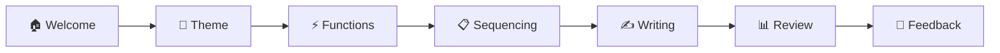

# Story Builder App 📚✨

<div align="center">


*Transform your storytelling with AI-powered narrative guidance*

[🚀 Quick Start](#-getting-started) • [📖 Documentation](#-how-to-use) • [🎯 Features](#-features) • [🤝 Contributing](#-contributing)

</div>

---

## 📋 Overview

**Story Builder App** is an innovative AI-powered interactive storytelling platform that revolutionizes the creative writing process. Built on **Vladimir Propp's narrative functions** - a systematic approach to fairy tale structure - this application combines classical narrative theory with cutting-edge AI technology to help writers of all levels create compelling, well-structured stories.

### 🎯 What Makes This Special?

- **📚 Educational**: Learn story structure through Propp's 31 narrative functions
- **🤖 AI-Enhanced**: Google Gemini integration for intelligent writing assistance  
- **🎮 Gamified**: Achievement system with badges to motivate continuous improvement
- **📊 Analytics-Driven**: Detailed writing statistics and quality analysis
- **🎨 User-Friendly**: Intuitive step-by-step guided interface

## 🌟 Features

<details>
<summary><b>🎯 Core Functionality</b></summary>

- **🤖 AI-Powered Story Creation**: Deep integration with Google Gemini API for context-aware writing suggestions
- **📜 Propp's Narrative Functions**: Implement Vladimir Propp's 31 morphological functions for structurally sound storytelling
- **🎭 Interactive Writing Process**: 7-step guided journey from concept to completion
- **⚡ Real-time AI Collaboration**: Dynamic suggestions that adapt to your unique writing style and story context
- **💾 Smart Story Persistence**: Automatic saving with localStorage integration
- **🔄 Contextual Continuity**: AI maintains story coherence across all narrative segments

</details>

<details>
<summary><b>🚀 Advanced Features</b></summary>

- **📈 English Quality Analysis**: Comprehensive AI-powered writing assessment including:
  - Grammar and syntax evaluation
  - Vocabulary diversity scoring
  - Sentence structure analysis
  - Overall readability metrics
- **🏆 Badge Achievement System**: Gamified experience with 9 unique badges across 4 rarity tiers
- **📊 Comprehensive Analytics**: Deep insights including:
  - Word count and writing velocity
  - Time spent per section
  - AI collaboration percentage
  - User vs AI content ratio
- **💾 Multiple Export Options**: 
  - PDF generation with formatted layout
  - Plain text file download
  - Story screenshot capture
- **📱 Responsive Design**: Fully optimized for desktop, tablet, and mobile devices
- **🔒 Privacy-First**: Stories remain private and are not stored on servers

</details>

<details>
<summary><b>🏆 Badge System & Gamification</b></summary>

Writers can earn prestigious badges based on their performance and achievements:

| Rarity | Badge | Icon | Criteria | Description |
|---------|-------|------|----------|-------------|
| **Legendary** | Perfect Harmony | 🌈 | 2000+ words, 90+ quality, balanced AI use | Master of all aspects |
| **Legendary** | Epic Wordweaver | ✨ | 3000+ words, 88+ quality, 45+ minutes | Epic tale creator |
| **Rare** | Voice Master | 🎭 | 85+ quality, 800+ words | Consistent narrative style |
| **Rare** | Master Storyteller | 👑 | 90+ quality score | Excellence in writing quality |
| **Uncommon** | Wordsmith | 📝 | 1000+ words | Prolific writer |
| **Uncommon** | Balanced Writer | ⚖️ | 40-60% user content | Perfect AI collaboration |
| **Common** | Speed Demon | ⚡ | Complete in <30 minutes | Fast and efficient |
| **Common** | AI Companion | 🤖 | 5-15 AI suggestions used | Smart AI utilization |
| **Common** | Effort Star | ⭐ | 60+ quality score | Recognition for good effort |

</details>

## 🛠️ Technology Stack

<table>
<tr>
<td><b>Frontend</b></td>
<td><b>Backend</b></td>
<td><b>AI & APIs</b></td>
</tr>
<tr>
<td>

  
  
  


</td>
<td>

  
  
  


</td>
<td>

  
  


</td>
</tr>
</table>

### 🔧 Development Tools
- **Concurrently** - Run multiple npm scripts simultaneously
- **Nodemon** - Auto-restart server during development
- **Helmet** - Security middleware for Express
- **Express Rate Limit** - API rate limiting
- **Express Validator** - Input validation and sanitization

## 🚀 Getting Started

### 📋 Prerequisites

Before you begin, ensure you have the following installed:

| Requirement | Version | Installation Link |
|-------------|---------|------------------|
| **Node.js** | ≥ 14.0.0 | [Download Node.js](https://nodejs.org/) |
| **npm** | Latest | Comes with Node.js |
| **Google AI API Key** | - | [Get API Key](https://aistudio.google.com/) |

### 📥 Installation

#### 1. **Clone the Repository**
```bash
# Clone the repository
git clone https://github.com/hardik0620/story-builder-app.git

# Navigate to project directory
cd story-builder-app

# Verify structure
ls -la
```

#### 2. **Backend Setup**
```bash
# Navigate to backend directory
cd src/backend

# Install dependencies
npm install

# Verify installation
npm list --depth=0
```

#### 3. **Frontend Setup**
```bash
# Navigate to frontend directory (from project root)
cd src/frontend

# Install dependencies
npm install

# Verify installation
npm list --depth=0
```

#### 4. **Environment Configuration**

Create a `.env` file in the `src/backend` directory:

```env
# Required: Google AI API Configuration
GOOGLE_AI_API_KEY=your_google_ai_api_key_here

# Server Configuration
PORT=3001
NODE_ENV=development

# CORS Configuration
CORS_ORIGIN=http://localhost:3000

# Optional: Rate Limiting
RATE_LIMIT_WINDOW_MS=900000
RATE_LIMIT_MAX_REQUESTS=100
```

<details>
<summary><b>🔑 How to Get Your Google AI API Key</b></summary>

1. **Visit Google AI Studio**: Go to [aistudio.google.com](https://aistudio.google.com/)
2. **Sign In**: Use your Google account to sign in
3. **Create Project**: Create a new project or select existing one
4. **Generate API Key**: 
   - Click "Get API Key" or "Create API Key"
   - Choose "Create API key in new project" or select existing project
   - Copy the generated API key
5. **Add to Environment**: Paste the key in your `.env` file
6. **Verify**: The key should start with `AIza...`

> ⚠️ **Important**: Keep your API key secure and never commit it to version control!

</details>

### 🖥️ Running the Application

#### 🎯 **Option 1: Quick Start (Recommended)**
```bash
# Navigate to backend directory
cd src/backend

# Start both frontend and backend simultaneously
npm run full
```

This will start:
- 🖥️ **Backend Server**: `http://localhost:3001`
- 🌐 **Frontend App**: `http://localhost:3000` (opens automatically)

#### 🔧 **Option 2: Manual Start (Development)**

**Terminal 1 - Backend Server:**
```bash
cd src/backend

# Production mode
npm start

# OR Development mode (auto-reload)
npm run dev
```

**Terminal 2 - Frontend Application:**
```bash
cd src/frontend  

# Start React development server
npm start
```

#### 📊 **Verify Installation**

Once both servers are running, verify everything works:

1. **Backend Health Check**: Visit `http://localhost:3001/api/health`
2. **Frontend Access**: Visit `http://localhost:3000`
3. **API Test**: Use the built-in API test component in the application

### 🌐 Production Deployment

<details>
<summary><b>📦 Building for Production</b></summary>

#### Frontend Build
```bash
cd src/frontend

# Create production build
npm run build

# The build folder will contain optimized static files
ls -la build/
```

#### Backend Production
```bash
cd src/backend

# Install PM2 globally (recommended)
npm install -g pm2

# Start with PM2
pm2 start server.js --name "story-builder-backend"

# OR standard Node.js
npm start
```

#### Environment Variables for Production
```env
NODE_ENV=production
PORT=3001
GOOGLE_AI_API_KEY=your_production_api_key
CORS_ORIGIN=https://yourdomain.com
```

</details>

<details>
<summary><b>☁️ Deployment Platforms</b></summary>

**Recommended Platforms:**

| Platform | Frontend | Backend | Notes |
|----------|----------|---------|-------|
| **Vercel** | ✅ Excellent | ✅ Serverless Functions | Easy deployment, great for React |
| **Netlify** | ✅ Excellent | ❌ N/A | Frontend only, need separate backend hosting |
| **Heroku** | ✅ Good | ✅ Excellent | Full-stack deployment |
| **Railway** | ✅ Good | ✅ Excellent | Modern alternative to Heroku |
| **DigitalOcean** | ✅ Good | ✅ Excellent | VPS with full control |

**Deployment Checklist:**
- [ ] Environment variables configured
- [ ] CORS origins updated for production domain
- [ ] Google AI API key activated for production
- [ ] Build scripts tested
- [ ] Database/storage configured (if needed)

</details>

## 📖 How to Use

### 🎭 **The Story Creation Journey**

Story Builder App guides you through a **7-step interactive process** designed to help you create compelling narratives:

<div align="center">



</div>

| Step | Phase | Description | Key Features |
|------|-------|-------------|--------------|
| **1** | 🏠 **Welcome** | Introduction to the storytelling process | • Platform overview<br>• Tutorial access<br>• Progress tracking setup |
| **2** | 🎨 **Theme Selection** | Choose your story's central theme | • Pre-defined themes (Adventure, Romance, Mystery, etc.)<br>• Custom theme creation<br>• Genre-specific prompts |
| **3** | ⚡ **Narrative Functions** | Select Propp's functions for story structure | • 31 classical narrative functions<br>• Visual function cards<br>• Educational descriptions |
| **4** | 📋 **Sequencing** | Arrange chosen functions in logical order | • Drag-and-drop interface<br>• Story flow validation<br>• Structure recommendations |
| **5** | ✍️ **Writing** | Craft your story with AI assistance | • Real-time AI suggestions<br>• Context-aware prompts<br>• Progress tracking |
| **6** | 📊 **Review & Analytics** | Analyze your completed story | • Quality assessment<br>• Badge achievements<br>• Performance metrics |
| **7** | 💭 **Feedback** | Share your experience | • User experience rating<br>• Improvement suggestions<br>• Feature requests |

### 🎯 **Key Interaction Patterns**

<details>
<summary><b>🤖 Working with AI Suggestions</b></summary>

- **Smart Prompting**: AI analyzes your current story context and selected functions
- **Adaptive Suggestions**: Recommendations become more personalized as you write
- **Collaborative Writing**: Balance between your creativity and AI assistance
- **Context Preservation**: AI maintains story coherence across all sections

**Best Practices:**
- Use AI suggestions as inspiration, not replacement for creativity
- Aim for 40-60% original content for the "Balanced Writer" badge
- Review and edit AI suggestions to match your voice

</details>

<details>
<summary><b>📊 Understanding Quality Analysis</b></summary>

The AI-powered quality analysis evaluates:

- **Grammar & Syntax** (25%): Correct sentence structure and grammar usage
- **Vocabulary Diversity** (30%): Variety and richness of word choice  
- **Coherence** (25%): Logical flow and story consistency
- **Creativity** (20%): Original ideas and engaging narrative elements

**Quality Score Ranges:**
- 90-100: Exceptional writing quality 👑
- 80-89: Very good quality 🎭
- 70-79: Good quality 📝
- 60-69: Satisfactory effort ⭐
- Below 60: Room for improvement 📚

</details>

## 🎯 Architecture & Components

### 🏗️ **System Architecture**

```
┌─────────────────────────────────────────────────────────────┐
│                    Story Builder App                         │
├─────────────────────────────────────────────────────────────┤
│  Frontend (React)           │  Backend (Node.js)             │
│  ├── Components/            │  ├── Routes/                   │
│  │   ├── AIWizard.js       │  │   ├── aiRoutes.js           │
│  │   ├── Step1Theme.js     │  │   ├── qualityRoutes.js      │
│  │   ├── Step4Writing.js   │  │   └── ...                   │
│  │   └── ...               │  ├── Controllers/              │
│  ├── Services/             │  │   ├── aiController.js       │
│  │   └── api.js            │  │   └── ...                   │
│  └── Utils/                │  ├── Middleware/               │
│      └── badgeSystem.js    │  │   └── errorHandler.js       │
│                             │  └── Data/                     │
│                             │      └── proppKnowledgeDB.js  │
└─────────────────────────────────────────────────────────────┘
                                     ↕️
                         ┌─────────────────────┐
                         │   Google Gemini AI  │
                         │   - Text Generation │
                         │   - Quality Analysis│
                         └─────────────────────┘
```

### 🧩 **Frontend Components**

<details>
<summary><b>📦 Core Components</b></summary>

| Component | Purpose | Key Features |
|-----------|---------|--------------|
| **AIWizard** | Main application orchestrator | • Step navigation<br>• State management<br>• Progress tracking |
| **Step1Theme** | Theme selection interface | • Predefined themes<br>• Custom theme input<br>• Genre categorization |
| **Step2Functions** | Propp function selection | • Visual function cards<br>• Educational tooltips<br>• Selection validation |
| **Step4Writing** | Main writing interface | • Real-time AI suggestions<br>• Word count tracking<br>• Auto-save functionality |
| **Step5Review** | Story analysis and review | • Quality metrics<br>• Badge display<br>• Export options |
| **BadgeSystem** | Achievement management | • Badge calculation<br>• Rarity classification<br>• Progress visualization |

</details>

<details>
<summary><b>🔧 Utility Systems</b></summary>

- **API Service** (`services/api.js`)
  - Centralized HTTP client
  - Error handling and retries
  - Response caching
  - Request rate limiting

- **Badge System** (`utils/badgeSystem.js`)
  - Achievement calculation logic
  - Quality analysis algorithms
  - Rarity tier management
  - Performance metrics

- **Propp Knowledge Database**
  - 31 narrative functions with descriptions
  - Function relationship mapping
  - Story structure templates
  - Educational content

</details>

### 🛠️ **Backend API Architecture**

<details>
<summary><b>🚏 API Endpoints</b></summary>

| Endpoint | Method | Purpose | Input | Output |
|----------|--------|---------|-------|--------|
| `/api/health` | GET | Service health check | None | Status info |
| `/api/ai/suggest` | POST | Get AI writing suggestions | Story context, theme | Text suggestions |
| `/api/quality/analyze` | POST | Analyze text quality | Story text | Quality metrics |
| `/api/ai/generate-title` | POST | Generate story titles | Story summary | Title suggestions |

</details>

<details>
<summary><b>⚙️ Middleware & Security</b></summary>

- **Error Handler**: Centralized error processing and logging
- **CORS**: Configurable cross-origin resource sharing
- **Rate Limiting**: API request throttling (100 requests/15 minutes)
- **Helmet**: Security headers for Express
- **Morgan**: HTTP request logging
- **Validator**: Input sanitization and validation

</details>

## 🧪 Testing & Development

### 🔍 **Built-in Testing Tools**

The application includes comprehensive testing capabilities:

<details>
<summary><b>🔧 API Testing Interface</b></summary>

Access the built-in API test component to verify:

- **✅ Backend Connectivity**: Health check and response time
- **🤖 AI Suggestion Generation**: Context-aware writing prompts  
- **📊 Quality Analysis**: Text evaluation algorithms
- **🔗 Network Diagnostics**: Connection status and error handling

**How to Access**: Navigate to the application and look for the "API Test" component in the development interface.

</details>

<details>
<summary><b>🚨 Error Handling & Debugging</b></summary>

**Frontend Error Handling:**
- Component-level error boundaries
- Graceful fallback UI components
- Console logging for development
- User-friendly error messages

**Backend Error Handling:**
- Centralized error middleware
- API response standardization
- Request logging and monitoring
- Graceful degradation for AI services

**Debug Mode:**
```bash
# Enable debug logging
cd src/backend
DEBUG=story-builder:* npm run dev
```

</details>

### 📊 **Performance Monitoring**

<details>
<summary><b>⚡ Performance Metrics</b></summary>

**Frontend Performance:**
- React DevTools integration
- Component render optimization
- Bundle size analysis
- Loading state management

**Backend Performance:**
- Response time tracking
- Memory usage monitoring  
- API rate limiting
- Error rate analytics

**AI Performance:**
- Request/response latency
- Token usage optimization
- Fallback mechanism testing
- Quality analysis accuracy

</details>

### 🔧 **Development Workflow**

```bash
# Development setup
npm run dev          # Backend with auto-reload
npm start           # Frontend development server
npm run full        # Both services simultaneously

# Code quality
npm run lint        # Code linting (if configured)
npm run test        # Run test suites (if configured)

# Production preparation  
npm run build       # Create production build
npm run analyze     # Bundle analysis (if configured)
```

## 🤝 Contributing

1. Fork the repository
2. Create a feature branch (`git checkout -b feature/amazing-feature`)
3. Commit your changes (`git commit -m 'Add amazing feature'`)
4. Push to the branch (`git push origin feature/amazing-feature`)
5. Open a Pull Request

## 📝 License
This project currently does not include a license file.  
If you intend to use, modify, or distribute this code, please contact the repository owner or check back for future updates regarding licensing.

## 🙏 Acknowledgments

### 🏛️ **Academic Foundation**
- **[Vladimir Propp](https://en.wikipedia.org/wiki/Vladimir_Propp)** - For his groundbreaking work "Morphology of the Folktale" (1928) which established the systematic analysis of narrative structure through 31 distinct functions
- **[Aurora Constantin](https://sites.google.com/site/auroraconstantin/)** - For invaluable guidance and mentorship throughout the development process
- **[Sean Hammond](https://github.com/seanhammond)** - For inspiring this project through his innovative storytelling tool built without AI, demonstrating the power of pure narrative structure and user-centered design

### 🤖 **Technology Partners**
- **[Google AI Team](https://ai.google/)** - For providing the powerful Gemini API that enables intelligent writing assistance
- **[OpenAI Community](https://openai.com/)** - For advancing the field of AI-assisted creative writing
- **[React Team](https://react.dev/)** - For creating and maintaining the excellent React framework

### 🛠️ **Open Source Community**
- **[Node.js Foundation](https://nodejs.org/)** - For the robust server-side JavaScript platform
- **[Express.js Team](https://expressjs.com/)** - For the minimal and flexible web framework
- **[Create React App Team](https://create-react-app.dev/)** - For the excellent project scaffolding and configuration

### 📚 **Educational Resources**
- **[Harvard's CS50](https://cs50.harvard.edu/)** - For inspiring computer science education
- **[FreeCodeCamp](https://www.freecodecamp.org/)** - For democratizing programming education
- **[MDN Web Docs](https://developer.mozilla.org/)** - For comprehensive web development documentation

### 🎨 **Design & UX Inspiration**
- **[Material Design](https://material.io/)** - For design principles and patterns
- **[Dribbble Community](https://dribbble.com/)** - For creative design inspiration
- **[GitHub](https://github.com/)** - For hosting, collaboration, and version control

### 🌟 **Special Thanks**
- **Beta Testers** - Early users who provided valuable feedback
- **Creative Writing Community** - For insights into the writing process
- **Accessibility Advocates** - For ensuring inclusive design principles
- **Open Source Contributors** - Everyone who makes collaborative development possible

---

<div align="center">

**"Every great story begins with a single word, but every great application begins with a great community."**

*Built by [Hardik Pareek](https://github.com/hardik0620)*

</div>

## 📞 Support & Troubleshooting

### 🆘 **Common Issues & Solutions**

<details>
<summary><b>🔧 Installation Issues</b></summary>

**Problem**: Node.js version compatibility
```bash
# Check Node version
node --version

# Install Node Version Manager (recommended)
curl -o- https://raw.githubusercontent.com/nvm-sh/nvm/v0.39.0/install.sh | bash
nvm install 18
nvm use 18
```

**Problem**: npm install fails
```bash
# Clear npm cache
npm cache clean --force

# Delete node_modules and reinstall
rm -rf node_modules package-lock.json
npm install
```

**Problem**: Port conflicts
```bash
# Check what's using the port
lsof -i :3000  # or :3001 for backend

# Kill the process
kill -9 <PID>
```

</details>

<details>
<summary><b>🤖 AI Integration Issues</b></summary>

**Problem**: "Invalid API Key" error
- Verify API key format (should start with `AIza...`)
- Check Google AI Studio for key status
- Ensure key has Gemini API access enabled

**Problem**: AI suggestions not working
- Check backend logs: `cd src/backend && npm run dev`
- Verify internet connection
- Test API key with curl:
```bash
curl -X POST \
  'https://generativelanguage.googleapis.com/v1beta/models/gemini-pro:generateContent?key=YOUR_API_KEY' \
  -H 'Content-Type: application/json' \
  -d '{"contents":[{"parts":[{"text":"Test"}]}]}'
```

**Problem**: Quality analysis returning basic scores
- This indicates AI analysis failed, fallback is working
- Check API quotas in Google Cloud Console
- Verify network connectivity

</details>

<details>
<summary><b>💾 Data & Storage Issues</b></summary>

**Problem**: Stories not saving
- Check browser localStorage capacity
- Clear browser data if needed
- Verify JavaScript is enabled

**Problem**: Export functionality not working  
- Check popup blockers
- Ensure sufficient storage space
- Try different export format

</details>

### 📧 **Getting Help**

If you encounter issues not covered here:

1. **📖 Check Documentation**: Review this README thoroughly
2. **🔍 Search Issues**: [GitHub Issues](https://github.com/hardik0620/story-builder-app/issues)
3. **🆕 Create New Issue**: Use the issue template with:
   - Clear problem description
   - Steps to reproduce
   - Error messages and logs
   - System information (OS, Node version, browser)
4. **💬 Discussions**: [GitHub Discussions](https://github.com/hardik0620/story-builder-app/discussions) for questions

### 📋 **Issue Template**

```markdown
## Bug Report

**Environment:**
- OS: [e.g., macOS 12.0, Ubuntu 20.04, Windows 11]
- Node.js: [e.g., v18.17.0]
- Browser: [e.g., Chrome 115, Firefox 116]

**Problem:**
[Clear description of the issue]

**Steps to Reproduce:**
1. Step one
2. Step two  
3. Step three

**Expected Behavior:**
[What should happen]

**Actual Behavior:**
[What actually happens]

**Error Messages:**
[Include console errors, server logs, etc.]

**Additional Context:**
[Screenshots, additional information]
```

## 🔮 Roadmap & Future Enhancements

### 🎯 **Planned Features**

<details>
<summary><b>📅 Short-term Goals (Next 3 months)</b></summary>

- **🔐 User Authentication System**
  - Account creation and login
  - Story cloud synchronization
  - Personal story library

- **📱 Mobile App Development**
  - React Native implementation
  - Offline writing capabilities
  - Mobile-optimized UI/UX

- **🎨 Enhanced Customization**
  - Custom themes and color schemes
  - Personalized AI writing styles
  - Adjustable difficulty levels

</details>

<details>
<summary><b>🚀 Medium-term Goals (3-6 months)</b></summary>

- **👥 Collaborative Writing**
  - Multi-user story creation
  - Real-time collaborative editing
  - Comment and suggestion system

- **📚 Extended Narrative Frameworks**
  - Hero's Journey integration
  - Three-Act Structure support
  - Genre-specific templates

- **🤖 Advanced AI Features**
  - Character development assistance
  - Plot consistency checking
  - Style matching algorithms

</details>

<details>
<summary><b>🌟 Long-term Vision (6+ months)</b></summary>

- **🌍 Multi-language Support**
  - Interface localization
  - AI assistance in multiple languages
  - Cultural story adaptation

- **🎓 Educational Platform**
  - Creative writing courses
  - Structured learning paths
  - Teacher/student dashboards

- **📊 Advanced Analytics**
  - Writing pattern analysis
  - Progress tracking over time
  - Personalized improvement recommendations

- **🎮 Gamification Expansion**
  - Story competitions
  - Community challenges
  - Advanced achievement system

</details>

### 💡 **Contribution Ideas**

We welcome contributions in these areas:

- **🐛 Bug Fixes**: Help us improve stability
- **🎨 UI/UX Improvements**: Enhance user experience  
- **📝 Documentation**: Improve guides and tutorials
- **🔧 Performance Optimization**: Make the app faster
- **🧪 Testing**: Add test coverage
- **🌐 Internationalization**: Add language support
- **♿ Accessibility**: Improve accessibility features

---

**Happy Storytelling!** 🎉📖

*Made by [Hardik Pareek](https://github.com/hardik0620)*
